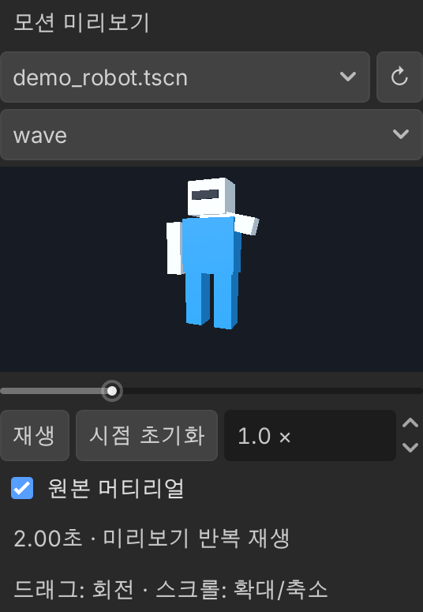
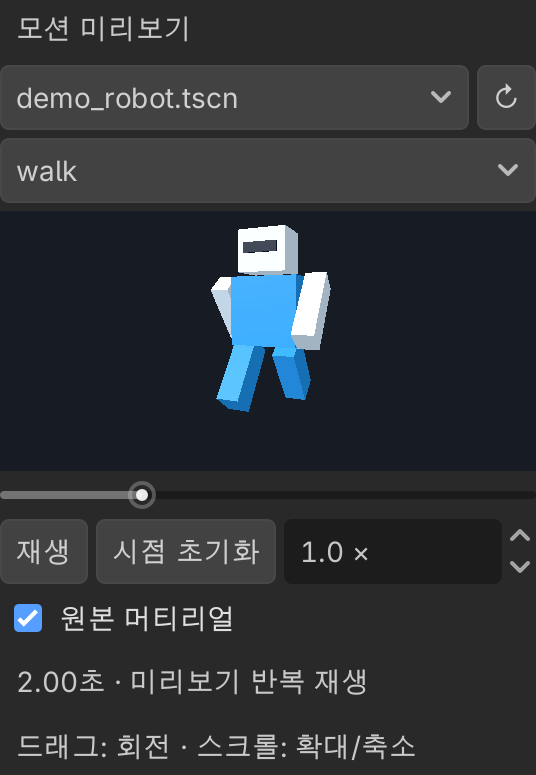

# Motion Preview

**한국어** | [English](README.en.md)

## 소개

Godot에서 애니메이션 라이브러리(`AnimationLibrary`)를 선택하면 인스펙터에서 3D 모델에 적용한 모션을 미리 보는 에디터 플러그인입니다. 게임을 실행하거나 미리보기 씬을 따로 만들지 않고 여러 모션을 확인할 수 있습니다. Godot 4.7 이상을 대상으로 합니다.

| 손 흔들기 자세 | 걷기 자세 |
|---|---|
|  |  |

데모 모델을 사용한 실제 인스펙터 화면입니다. [전체 에디터 화면 보기](docs/images/motion-preview-editor.png)

## 게임 프로젝트에서 설치하고 사용하기

### 설치

1. 이 저장소의 Releases에서 플러그인을 다운로드하고 압축을 풉니다.
2. `motion_preview` 폴더를 게임 프로젝트의 `addons/`에 넣습니다. 최종 경로는 `addons/motion_preview/plugin.cfg`가 되어야 합니다.
3. Godot에서 **프로젝트 → 프로젝트 설정 → 플러그인**을 열고 **Motion Preview**를 켭니다.
4. 모델과 애니메이션의 임포트가 끝날 때까지 기다립니다.

업데이트하거나 제거하기 전에는 플러그인을 끄거나 에디터를 닫습니다. 업데이트할 때는 기존 플러그인 폴더를 새 버전으로 교체합니다.

### 사용

1. 파일시스템에서 `AnimationLibrary`로 임포트한 FBX 또는 `.tres` / `.res` 애니메이션 라이브러리를 **한 번 클릭**합니다. FBX를 더블클릭하면 Godot의 임포트 설정이 열립니다.
2. 인스펙터 미리보기의 **모델 선택…** 메뉴에서 모델을 고릅니다.
3. 첫 애니메이션이 반복 재생됩니다. 여러 애니메이션이 있으면 클립 메뉴에서 바꿉니다.

- **일시정지 / 재생**, 시간 슬라이더, **0.1~3배속**으로 모션을 확인합니다. 시간 슬라이더를 움직이면 일시정지합니다.
- 드래그로 시점을 회전하고 스크롤로 확대·축소합니다. **시점 초기화**를 누르면 모델 전체가 보이는 구도로 돌아갑니다.
- **원본 머티리얼**을 켜면 자세 확인용 무광 머티리얼 대신 모델의 머티리얼을 표시합니다.
- 다른 라이브러리를 선택하거나 에디터를 다시 열어도 마지막 모델 선택을 유지합니다.
- 모델 목록은 추가·이동·재임포트 후 갱신됩니다. **↻**로 직접 새로 고칠 수도 있습니다.

### 사용할 모델과 애니메이션

모델은 프로젝트 전체에서 자동으로 찾습니다. FBX·GLB 등으로 임포트한 모델이나 `.tscn` / `.scn` 중 **스크립트가 없고, Skeleton3D가 하나이며, 실제 메시가 있는 씬**이 목록에 표시됩니다. 게임용 스크립트가 붙은 씬은 목록에서 제외됩니다. 해당 캐릭터를 미리 보려면 사용자가 스크립트 없는 외형 씬을 따로 저장해야 합니다. 별도의 에셋 폴더를 만들 필요는 없습니다.

모델과 모션은 같은 스켈레톤과 기준 자세용으로 준비합니다. 필요한 본이 없으면 해당 애니메이션을 재생하지 않고 누락된 본을 표시합니다. 본 이름이 같아도 다른 비율·기준 자세·본 계층을 자동으로 맞추는 리타겟팅은 제공하지 않습니다.

본의 위치·회전·스케일 애니메이션을 재생하며, 메서드 호출·오디오·일반 속성 트랙은 재생하지 않습니다. 루트 모션으로 모델이 화면 밖으로 이동할 수 있으며, 제자리 고정 기능은 없습니다. 원본 모델·애니메이션과 현재 편집 씬은 변경하지 않습니다.

## 소스를 받아 수정하기

저장소를 클론한 뒤 다음 순서로 작업합니다.

1. Godot에서 `project.godot`을 엽니다. 플러그인은 기본으로 활성화되어 있습니다.
2. `addons/motion_preview/` 아래의 GDScript를 수정합니다. 직접 준비한 모델과 애니메이션을 개발 프로젝트에 넣으면 에디터에서 동작을 확인할 수 있습니다.
3. 변경 후 아래 회귀 검사로 기존 기능이 유지되는지 확인합니다.
4. 아래 배포 스크립트로 ZIP을 만든 뒤 원하는 게임 프로젝트에 설치합니다.

### 기존 기능의 회귀 검사

새 기능을 추가하면서 기존 동작을 깨뜨리지 않았는지 확인하는 테스트입니다. 임시 프로젝트에 간단한 모델과 애니메이션을 직접 생성하므로 외부 에셋 없이 실행할 수 있습니다.

- 라이브러리를 선택하면 미리보기가 나타나고, 모델을 찾아 선택할 수 있는지 확인합니다.
- 시간 슬라이더를 움직이면 모델의 본 자세가 바뀌는지 확인합니다.
- 다른 라이브러리 선택과 플러그인 재활성화 후에도 모델 선택이 유지되는지 확인합니다.
- 초기 구도와 표시 영역 크기 변경 시 모델이 화면에 들어오는지, 사용자가 조절한 시점은 유지되는지 확인합니다.

Godot 실행 파일과 Python 3을 준비하고 저장소 루트에서 실행합니다. `godot`이 PATH에 없으면 실행 파일 경로로 바꿉니다.

```sh
godot --headless --path . --editor --quit
python3 tests/check_motion_preview_portability.py godot
```

검사에 실패하면 0이 아닌 종료 코드로 끝납니다. 로그는 `output/motion_preview_checks/portable_editor.log`에 생성됩니다.

표시를 변경했다면 그래픽 환경에서 다음 명령도 실행합니다.

```sh
python3 tests/check_motion_preview_portability.py godot --render
```

같은 결과 폴더의 `initial.png`, `reset.png`, `narrow.png`를 열어 실제 화면도 확인합니다.

이 테스트가 새 기능의 정확성까지 검증하지는 않습니다. 새 기능에 맞는 검사를 추가하고, 기존 동작을 의도적으로 바꿨다면 관련 검사도 수정합니다. 다양한 모델·애니메이션 형식과 스켈레톤에 대한 호환성은 별도로 확인해야 합니다.

### 수정한 플러그인 설치하기

저장소 루트에서 Python 3으로 실행합니다.

```sh
python3 release.py
```

`output/motion_preview-<버전>.zip`이 생성됩니다. ZIP에는 플러그인 내용물만 들어 있으며, 버전은 `addons/motion_preview/plugin.cfg`에서 읽습니다.

ZIP을 풀어 나온 `motion_preview` 폴더를 원하는 Godot 프로젝트의 `addons/` 아래로 옮깁니다. 최종 경로가 `addons/motion_preview/plugin.cfg`인지 확인하고 플러그인을 켭니다. 기존 설치를 교체할 때는 먼저 플러그인을 끄거나 에디터를 닫습니다.
